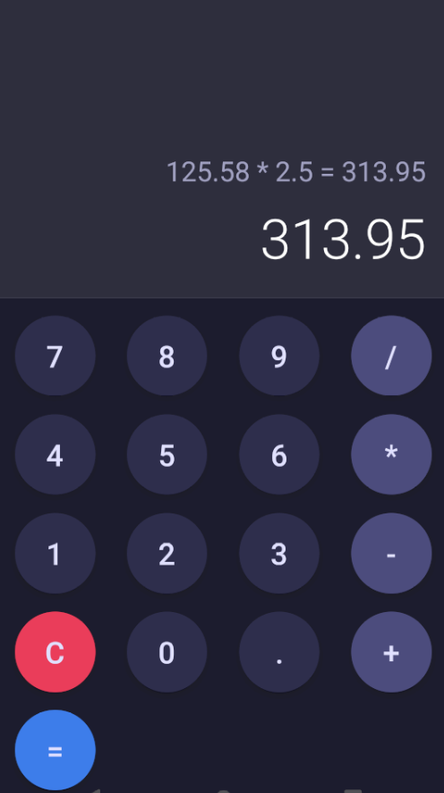

# Calculator2025_React_Native

Download apk file: [https://drive.google.com/file/d/1AIJXtF8SajXQHgcmuF_zKaxEYuQOj2c6/view?usp=sharing](https://drive.google.com/file/d/1AIJXtF8SajXQHgcmuF_zKaxEYuQOj2c6/view?usp=sharing)

A simple calculator for Android, developed with React Native, Expo and Genymotion(Android Emulator).

Visual Studio Code Extensions: Babel JS, React Native Tools

How to use:

Open Genymotion, Start

>npx create-expo-app Calculator --template

select Blank TypeScript

>cd Calculator

copy App.tsx to Calculator/

>npx expo start

type a
